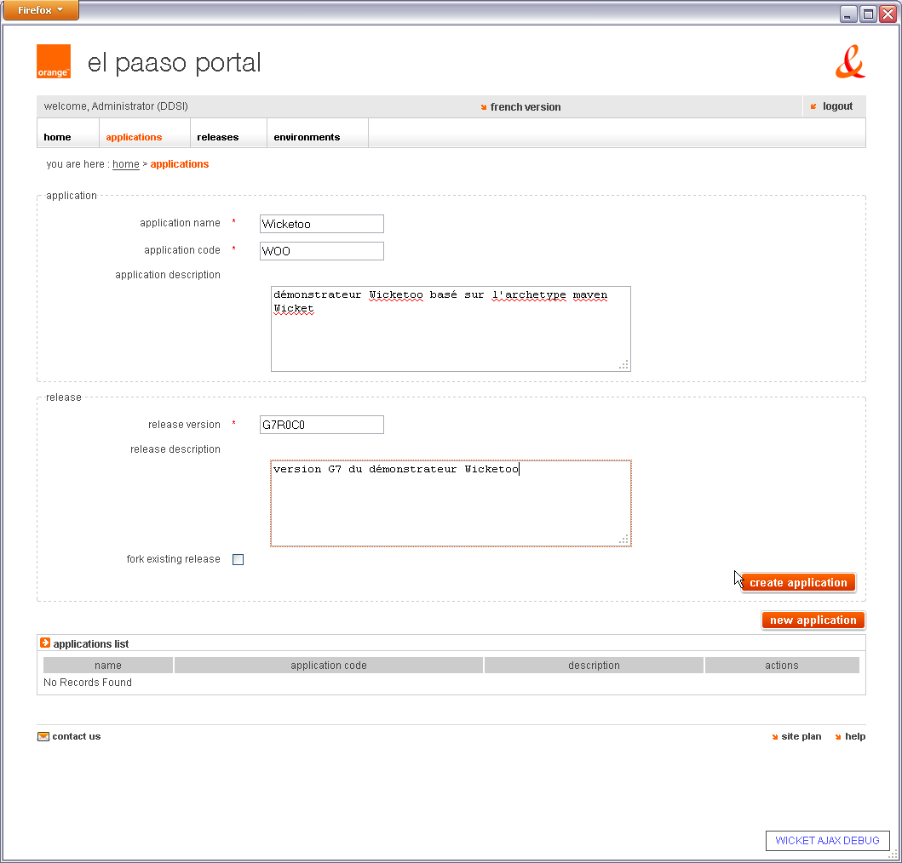

# web portal overview

The web portal is the main way to interact with El PaaSo. It currently includes three modules:

* the administration portal itself,
* the consolidated logs query tool (Splunk),
* the monitoring tool (Hyperic).

After authentication, the portal offers to:

* self-service application management:
    * [declaring applications and creating application releases](#declaring_applications_and_creating_application_releases)
    * defining the logical architecture,
        * [creating logical services](#creating_logical_services),
        * [creating execution nodes](#creating_execution_nodes),
        * [setting associations between execution nodes and logical services](#setting_associations_between_execution_nodes_and_logical_services),
    * starting a projection from the logical architecture to a technical architecture templates
    * [instanciating and managing environments](#instanciating_and_managing_environments) for development, testing, pre-production or production
* accelerate deployments and improve their reliability,
* get exactly the same architecture from one environment to another (reproducible environments),

Defining a logical architecture consists in determining the number of execution nodes, to associate them logical services specifying with additional functional or technical parameters.

## screenshots

Screenshots give a better idea of how to use El PaaSo and its web UI.

### declaring applications and creating application releases

### creating logical services

### creating execution nodes

### setting associations between execution nodes and logical services

### instanciating and managing environments

## videos

In addition to the screenshots presented above, here are some videos showing usual operations on the portal. These videos are short (usually less than 2 minutes) and each one illustrates an aspects of the web portal applied to existing or fictitious applications that meet real use cases.

### looking at *Diane* application

duration: 2 minutes, require flash plugin

This video illustrate a global overview of an advanced logical architecture. It includes the following steps:

* looking at the application,
* looking at the application release,
* looking at the release logical architecture,
    * looking at each logical service of the logical architecture,
    * looking at each execution node of the logical architecture,
    * looking at associations between logical services and execution nodes,
* creating a new environment,
* looking at the link to the logs.

Watch the video [looking at *Diane* application](video/diane1.htm).

### modifying *Diane* application

duration: 2 minutes, require flash plugin

This video illustrate adding logical services to an advanced logical architecture. It includes the following steps:

* looking at the application,
* looking at the application release,
* looking at the release logical architecture,
    * adding a new *webservice consumer* logical service to the logical architecture,
    * adding a new *point to point messaging* logical service to the logical architecture,
    * creating new associations between newly created logical services and execution nodes,
* creating a new environment,
* looking at the link to the logs.

Watch the video [modifying *Diane* application](video/diane2.htm).

### creating *Wicketoo* application

duration: 2 minutes, require flash plugin

This video illustrate creating a whole application, release and logical architecture. It includes the following steps:

* creating an application,
* creating an application release,
* creating a logical architecture,
    * adding a new *web GUI* logical service,
    * adding a new *database* logical service,
    * adding a new *JEE* execution node,
    * craating new associations between newly created logical services and execution nodes,
* creating a new environment,
* looking at the link to the logs.

Watch the video [creating *Wicketoo* application](video/wicketoo.htm).

### modifying *CXFoo* application

duration: 2 minutes, require flash plugin

This video illustrate adding logical services to an advanced logical architecture. It includes the following steps:

* looking at the application,
* looking at the application release,
* looking at the release logical architecture,
    * adding a new *webservice consumer (WSC)* logical service,
    * adding a new *web GUI* logical service,
    * adding a new *database* logical service,
    * adding a new *JEE* execution node,
    * craating new associations between newly created logical services and execution nodes,
* creating a new environment,
* looking at the link to the logs.

Watch the video [modifying *CXFoo* application](video/cxfoo.htm).