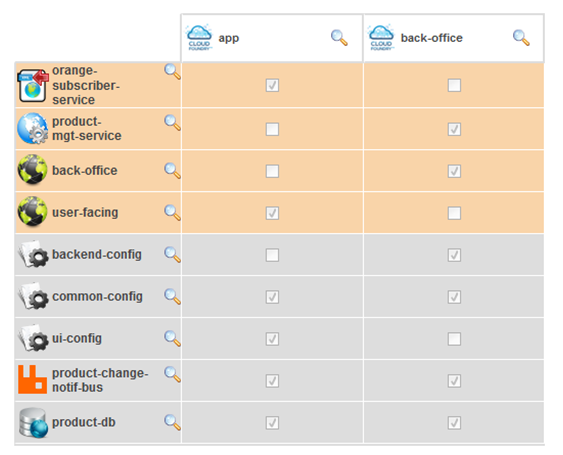

# El PaaSo overview

### definition of El PaaSo

The goal of El PaaSo is to help developers in deploying their applications by automating their deployment. 
This is achieved by specifying the architecture for the application, which is used as template for reproductibly instanciating the application multiple times across build/run cycles (development, testing, pre-production or production environment). 

In summary, elpaaso users only have to manage:

* their code (the application itself),
* their data (application data),

While the PaaS provides:

* the provisionning of technical resources (cf apps, routes)
* the subscription of required common services (e.g. monitoring, inventory/CMDB)
* the deployment and configuration of the application (through env vars)
* application monitoring and log management.

## interacting with El PaaSo

The main way to use El PaaSo is through the following flow in the web UI:

* declaring an application
* creating a release of an application
* defining a logical architecture (see-below) for a release version
* instantiating new environments for a release (for development, testing, pre-production or production purpose)
* managing these environments (stop, start, access to logs and metrics, delete ...)

The [web portal overview](web_portal_overview.md) offers some screenshots illustrating this woork flow in the UI.

The [SOAP API](north_api.md) is also available for automation or providing other UIs.

## the logical architecture and service catalog

The [logical architecture](logical_architecture.md) is a set of combined services describing the internal and external needs of the application. 

a sample logical architecture

